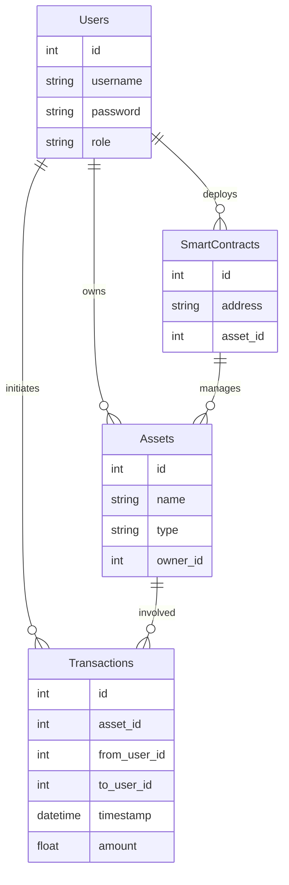

# asset-mgmt-dApp

## Initial ERD and Data Access

### Entity-Relationship Diagram (ERD)

The ERD for the decentralized asset management system will include the following entities and relationships:

- **Users**: Represents the users of the system, with attributes like `id`, `username`, `password` (hashed), and `role`.
- **Assets**: Represents the digital assets managed by the system, with attributes like `id`, `name`, `type`, and `owner_id` (foreign key referencing the Users table).
- **Transactions**: Represents transactions involving assets, with attributes like `id`, `asset_id` (foreign key referencing the Assets table), `from_user_id`, `to_user_id`, `timestamp`, and `amount`.
- **Smart Contracts**: Represents the smart contracts used for asset management on the Ethereum blockchain, with attributes like `id`, `address`, and `asset_id` (foreign key referencing the Assets table).

### Data Access

- **Data Sources**:
  - Ethereum Blockchain (via smart contracts)
  - PostgreSQL Database (for persistent storage)
  - Redis Cache (for performance optimization)
  - External APIs (for real-time market data)

- **Data Types**:
  - User information
  - Asset metadata
  - Transaction history
  - Smart contract data
  - Real-time market data

## Rough System Design

### System Components

1. **Backend (Go)**
   - Handles user requests and interacts with the database and blockchain.
   - Implements concurrency features for high request volumes.

2. **Database (PostgreSQL)**
   - Stores user data, asset metadata, and transaction history.
   - Ensures data durability and consistency.

3. **Caching Layer (Redis)**
   - Optimizes performance by caching frequently accessed data.
   - Uses a cache-aside strategy.

4. **Blockchain Integration (Ethereum Go Client)**
   - Interacts with the Ethereum blockchain for smart contract execution and data storage.
   - Ensures transparency and security.

5. **Security Measures**
   - Encryption for data at rest and in transit.
   - Role-based access control (RBAC) for authorized access.

6. **Load Balancing and Distributed Architecture**
   - Supports high traffic with subsecond latency.
   - Utilizes cloud services for scalability.

7. **External Data Integration**
   - Integrates with cryptocurrency price APIs for real-time market data.

### Interactions

- **User → Backend**: Sends requests to manage assets.
- **Backend → Database**: Retrieves and updates user data and asset metadata.
- **Backend → Caching Layer**: Caches frequently accessed data for performance.
- **Backend → Blockchain**: Executes smart contracts for asset transactions.
- **Blockchain → Backend**: Provides transaction data and smart contract states.
- **Backend → External APIs**: Fetches real-time market data.

## Initial Goals by Date

### 3/19

- **Research and Planning**:
  - Complete detailed research on Ethereum blockchain integration with Go.
  - Plan the database schema and caching strategy.
  - Outline the system architecture and security measures.

### 3/26

- **Backend Setup**:
  - Set up the Go backend environment.
  - Implement basic user authentication and authorization.
  - Start integrating with the Ethereum blockchain using the Go client.

### 4/2

- **Database and Caching Implementation**:
  - Implement the PostgreSQL database schema.
  - Set up Redis for caching and optimize performance.
  - Integrate the database and caching layer with the backend.

### 4/9

- **Blockchain Integration and Security**:
  - Complete the integration with the Ethereum blockchain.
  - Implement smart contract deployment and interaction.
  - Integrate encryption and access controls for security.

### 4/16

- **Scalability, Performance, and Testing**:
  - Implement load balancing and distributed architecture.
  - Conduct performance testing to ensure scalability.
  - Start integrating with external data sources for real-time market data.

## Additional Information

### UX Sketch

For a user-friendly interface, consider a web application with the following features:

- **Dashboard**: Displays user assets and recent transactions.
- **Asset Management**: Allows users to create, update, and manage assets.
- **Transaction History**: Shows a detailed history of all transactions.
- **Market Data**: Provides real-time market data for assets.

### Technologies

- **Backend**: Go
- **Database**: PostgreSQL
- **Caching**: Redis
- **Blockchain**: Ethereum
- **Security**: Encryption, RBAC
- **Cloud Services**: AWS or Google Cloud for scalability and failover

### Challenges

- **Concurrency Issues**: Implementing locking mechanisms or transactional databases to ensure data consistency.
- **Blockchain Integration**: Handling gas prices and transaction delays on the Ethereum network.
- **Scalability**: Ensuring the system can handle high traffic with subsecond latency.
